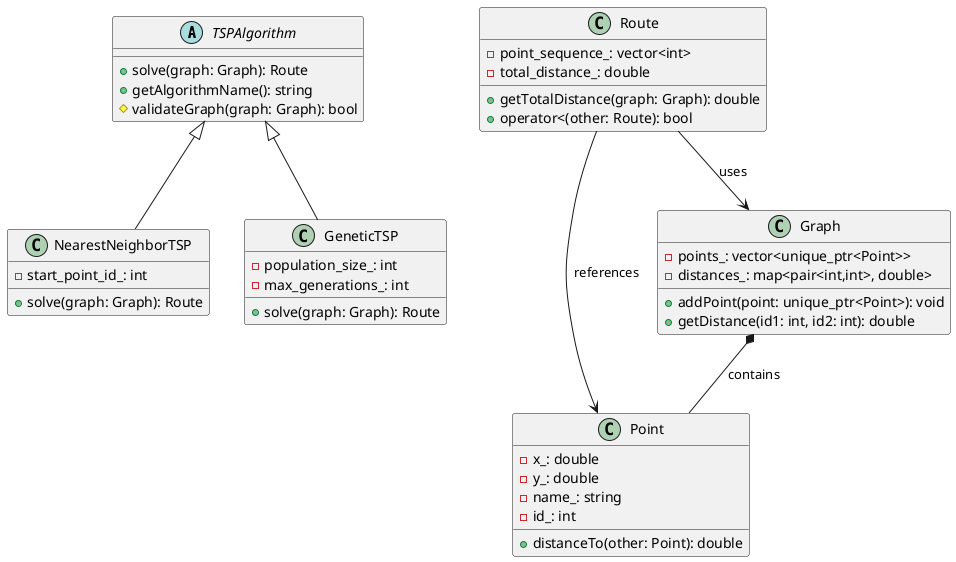

# Diagrama UML de Classes - TSP Route Optimizer

## Descrição Textual do Diagrama UML

### Hierarquia de Classes Principais

```
TSPAlgorithm (Abstract)
├── NearestNeighborTSP
├── GeneticTSP  
└── TwoOptTSP

Point
├── Composition: Graph contains Point*
└── Composition: Route references Point (by ID)

Graph
├── Contains: vector<unique_ptr<Point>>
├── Contains: map<pair<int,int>, double> (distances cache)
└── Uses: Point

Route  
├── Contains: vector<int> (point sequence by IDs)
├── Uses: Graph (to calculate distances)
└── References: Point (by ID)

TSPException (Abstract)
├── InvalidGraphException
├── FileIOException
└── AlgorithmException
```

### Relacionamentos Detalhados

#### 1. TSPAlgorithm (Classe Abstrata)
- **Herança**: Classe base abstrata
- **Polimorfismo**: Método virtual puro `solve()`
- **Especialização**:
  - `NearestNeighborTSP`: Algoritmo guloso O(n²)
  - `GeneticTSP`: Algoritmo evolutivo O(g×p×n²) 
  - `TwoOptTSP`: Otimização local O(n²)

#### 2. Graph (Composição Principal)
- **Contém**: `vector<unique_ptr<Point>>` (ownership forte)
- **Cache**: `map<pair<int,int>, double>` (otimização)
- **Interface**: CRUD completo para pontos
- **Persistência**: Load/save de arquivos

#### 3. Route (Solução TSP)
- **Contém**: `vector<int>` (sequência de IDs)
- **Usa**: Graph para calcular distâncias
- **Sobrecarga**: Operadores <, +, ==, << 
- **Otimização**: Método 2-opt interno

#### 4. Point (Entidade Básica)
- **Encapsulamento**: Coordenadas privadas
- **Interface**: Getters/setters com validação
- **Comportamento**: Cálculo de distância euclidiana
- **Comparação**: Operadores de ordenação

#### 5. Exceções (Hierarquia)
- **Base**: `TSPException` herda de `std::exception`
- **Especializações**: Para diferentes tipos de erro
- **Uso**: Tratamento robusto em toda aplicação

### Padrões de Design Aplicados

#### Strategy Pattern
```cpp
class TSPSolver {
    unique_ptr<TSPAlgorithm> algorithm_;
public:
    Route solve(Graph& graph) {
        return algorithm_->solve(graph);
    }
};
```

#### Composition over Inheritance
```cpp
class Graph {
    vector<unique_ptr<Point>> points_;  // HAS-A (não IS-A)
};

class Route {
    vector<int> point_ids_;  // Referencias, não ownership
};
```

#### Template Method Pattern
```cpp
class TSPAlgorithm {
protected:
    virtual void preProcess(const Graph& graph) {}
    virtual void postProcess(Route& route) {}
public:
    Route solve(const Graph& graph) final {
        preProcess(graph);
        Route route = doSolve(graph);  // virtual puro
        postProcess(route);
        return route;
    }
};
```

### Fluxo Principal de Execução

1. **Entrada**: Carregar pontos em `Graph`
2. **Algoritmo**: Criar instância de `TSPAlgorithm` específico
3. **Resolução**: Chamar `algorithm->solve(graph)`
4. **Resultado**: Obter `Route` otimizada
5. **Saída**: Visualizar ou salvar resultado

### Conceitos POO Demonstrados

✅ **Abstração**: Interfaces limpas, separação de responsabilidades  
✅ **Encapsulamento**: Dados privados, getters/setters validados  
✅ **Herança**: Hierarquia TSPAlgorithm + TSPException  
✅ **Polimorfismo**: Métodos virtuais, ligação dinâmica  
✅ **Composição**: Graph HAS-A Point, Route USA Graph  
✅ **Templates**: STL containers, smart pointers  
✅ **Exceções**: Hierarquia robusta de erros  
✅ **RAII**: Smart pointers, gerenciamento automático  
✅ **Sobrecarga**: Operadores realistas em Route  
✅ **STL**: vector, map, unique_ptr, optional

---

## Instruções para Gerar UML Visual

Para gerar diagrama visual, use uma ferramenta como:
- **PlantUML**: Texto para UML automático
- **Draw.io**: Editor visual online
- **Lucidchart**: Ferramenta profissional
- **yEd**: Software desktop gratuito

### Código PlantUML (Opcional)
